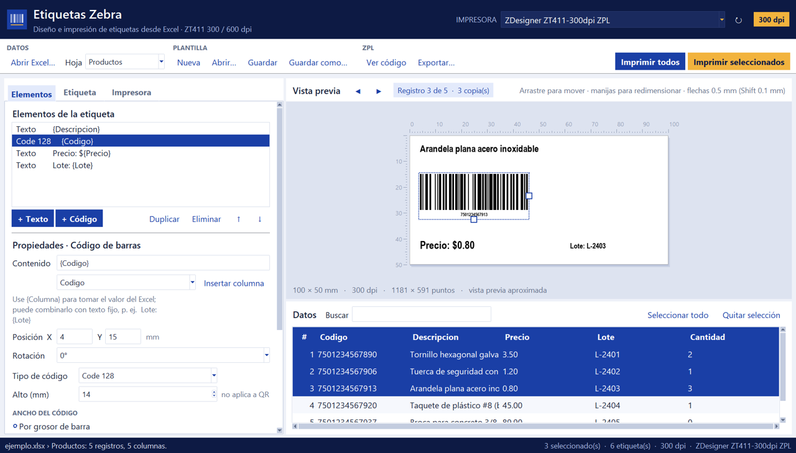

# Etiquetas Zebra

Aplicación de escritorio para **diseñar e imprimir etiquetas con código de barras** en
impresoras **Zebra ZT411 de 300 y 600 dpi**, tomando los datos desde un archivo de **Excel**.



## Características

- **Excel como base de datos**: cada fila es una etiqueta y cada columna un campo (`{Columna}`).
- **Diseñador visual**: textos y códigos de barras que se mueven y redimensionan con el mouse,
  con reglas en milímetros y vista previa con datos reales.
- **Códigos de barras**: Code 128, Code 39, EAN-13, UPC-A, QR y DataMatrix, generados por la
  impresora en ZPL nativo para obtener barras nítidas.
- **300 y 600 dpi con la misma plantilla**: las medidas se guardan en mm y se convierten a
  puntos al imprimir. La resolución se detecta por el nombre de la impresora.
- **Ancho del código ajustable**: por grosor de barra o con ancho fijo en mm.
- **Copias por registro** desde una columna del Excel (p. ej. `Cantidad`).
- **Impresión** por la cola de Windows (RAW, driver ZDesigner) o directa por red (TCP 9100).
- Herramientas: imprimir prueba, calibrar sensor (`~JC`), imprimir configuración (`~WC`),
  ver y exportar el ZPL generado.
- Plantillas en `.json` reutilizables; recuerda el último Excel, plantilla e impresora.

## Requisitos

- Windows 10/11
- Python 3.10 o superior ([python.org](https://www.python.org/downloads/), marque *Add Python to PATH*)
- Impresora Zebra ZT411 instalada con el driver **ZDesigner**, o accesible por red

Dependencias (se instalan solas con `run.bat`): `openpyxl`, `Pillow`, `python-barcode`,
`qrcode`, `pywin32`.

## Instalación y ejecución

**Opción rápida:** doble clic en **`run.bat`**. La primera vez crea el entorno `.venv` e
instala las dependencias; después solo abre el programa.

**Desde la terminal** (no es necesario activar el entorno):

```powershell
python -m venv .venv
.\.venv\Scripts\python.exe -m pip install -r requirements.txt
.\.venv\Scripts\python.exe app.py
```

## Uso rápido

1. **Abrir Excel…** y elegir la hoja. La fila 1 debe contener los encabezados.
2. En **Elementos**, agregar textos y códigos. En *Contenido* escriba `{Columna}` o use
   **Insertar columna** (se puede mezclar con texto fijo: `Lote: {Lote}`).
3. Acomodar los elementos arrastrándolos en la vista previa.
4. En **Etiqueta**, ajustar el tamaño (mm) y, si aplica, la columna de cantidad.
5. Elegir la impresora en el encabezado.
6. Seleccionar filas y pulsar **Imprimir seleccionados**, o **Imprimir todos**.
7. **Guardar** la plantilla para reutilizarla.

Para probar de inmediato: abra `ejemplo.xlsx` y la plantilla `plantilla_ejemplo.json`.

📘 Instrucciones completas en el **[Manual de uso](docs/MANUAL_DE_USO.md)**.

## Estructura del proyecto

| Archivo | Descripción |
|---|---|
| `app.py` | Interfaz gráfica (Tkinter) y flujo de la aplicación |
| `zpl.py` | Modelo de plantilla (`Template`, `Element`) y generación de ZPL II |
| `symbols.py` | Geometría de los códigos de barras (módulos, ancho del símbolo) |
| `preview.py` | Vista previa de la etiqueta con Pillow |
| `printing.py` | Envío del ZPL: cola de Windows en modo RAW o socket TCP 9100 |
| `excel_data.py` | Lectura de hojas de Excel respetando formatos numéricos y fechas |
| `theme.py` | Paleta de colores (azul rey / dorado) y estilos ttk |
| `run.bat` | Lanzador: crea el entorno, instala dependencias y abre la app |
| `ejemplo.xlsx`, `plantilla_ejemplo.json` | Datos y plantilla de ejemplo |

## Generar un ejecutable (.exe)

```powershell
.\.venv\Scripts\python.exe -m pip install pyinstaller
.\.venv\Scripts\pyinstaller.exe --noconsole --onefile --name EtiquetasZebra app.py
```

El ejecutable queda en `dist\EtiquetasZebra.exe`.

## Autor

J. Alexis
